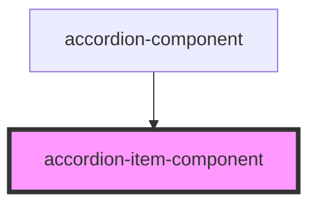

# accordion-item-component

<!-- Auto Generated Below -->

## Properties

| Property            | Attribute            | Description | Type     | Default           |
| ------------------- | -------------------- | ----------- | -------- | ----------------- |
| `buttonLabel`       | `button-label`       |             | `string` | `undefined`       |
| `buttonLabel_hover` | `button-label_hover` |             | `string` | `'Are you sure?'` |
| `itemContent`       | `item-content`       |             | `string` | `undefined`       |

## Events

| Event                 | Description | Type                                  |
| --------------------- | ----------- | ------------------------------------- |
| `accordionItemToggle` |             | `CustomEvent<AccordionItemComponent>` |

## Dependencies

### Used by

 - [accordion-component](../accordion-component)

### Graph

----------------------------------------------

